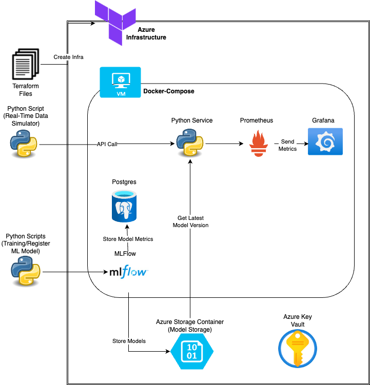

# Objective

This repository contains the final project for the [MLOpsZoomcamp course](https://github.com/DataTalksClub/mlops-zoomcamp).

The goal of the project is to apply what has been learned during the MLOps Zoomcamp. This project has as background a machine learning model to predict the quality of wines based on a selection of available attributes. However, the main goal was to build the plataform that support the development and operacionalization of such model:

1. **Cloud elements**: VMs, Databases, Blob Storages, etc. Automatization (Architecture as Code) with Terraform
2. **Experiment Tracking**: Tracking of model performance and hiperparameter tunning
3. **Workflow Orchestration**: Automatization of data processing and training procedures
4. **Model Deployment**: Common architectures for deployment models as batch, online or streaming
5. **Model Monitoring**: Tracking of machine learning specific metrics, such as model performance and data drift
6. **Software Engineering Best Practices**:
    * Unit Tests
    * Integration Tests
    * Linter and code formatters
    * Makefile
    * Pre-commit Hooks
    * CI/CD pipelines

# Introduction

In this project I focused in exposing an online API that would receive requests with the model's input data and output the wine quality prediction.

In order to support this API and the overall DevOps cycle the following architecture was developed:

1 - Folder `infrastructure` contains the files needed to create the **Azure** infrastructure, including:
    - Virtual Machine (VM)
    - Virtual Networks
    - Azure Storage Containers (Similar to AWS S3)
    - Azure Key Vault

2 - The VM is created and then automatically initialized with the script `infrastructure/cloud-config.yaml` that installs all the required packages to build and run a docker-container containing all the services needed for this project:
    - **Prediction service** (folder `prediction_service`): API to receive requests and return the predictions. The model will load the registered model from MLFlow and use it to make new predictions. In the first times that the service is run, there won't be a model trained and registered yet in MLFlow, so I added a `prediction_service/sample_model.pkl` that will be loaded temporarily while there are no models in the MLFlow registry.
    - **Prometheus** (folder `prometheus`): Scrape metrics about the system's condition and model metrics
    - **Grafana** (folder `grafana`): Collect metrics from Prometheus and display dashboards and alerts
    - **MLFlow** (folder `mlflow`): Track and version model training
    - **PostgreSQL** (no folder, downloaded directly from docker): Store metrics from MLFlow

# Setup Instructions

## Terraform

1 - Setup a free account in [Azure](https://azure.microsoft.com/ja-jp/free/) and get the free credits (Sorry, the page is in Japanese but you can use a translator)

2 - In order to be able to be ableto create Azure Resources via Terraform, you need to manually create an application that contains the necessary permissions. In case you don't know, follow the steps in this video, https://youtu.be/wB52Rd5N9IQ?si=TviEVsM8N9uUsh29&t=754 (the specific timestamp is already selected). Add the variables `subscription_id`, `client_id`, `client_secret`, `tenant_id` to the `infrastructure/terraform.tfvars` as shown in `infrastructure/terraform.tfvars.sample`.

3 - Proceed with the infrastructure creation with terraform commands in the `infrastructure` folder. `terraform init`, `terraform plan -out main.tfout`, and `terraform apply main.tfout.

The above instructions will create the diagram showed above.

------------------------------------------------------------------------------------------------
Observation: In case you want to SSH the VM from your local computer, execute the following steps **from the same terminal you used to execute the terraform scripts**:
    * `terraform output -raw private_key_pem > <local_folder>` - This will export the private key needed to access the VM into your local folder
    * `ssh -i ~/.ssh/id_rsa.pem azureuser@$(terraform output -raw vm_public_ip_address)`. If it doesn't work, confirm if the VM's public IP in Azure Portal is correct with what terraform outputs with `terraform output -raw vm_public_ip_address`. In case it's not, replace the command by the correct IP.

--------------------------------
## Local docker-compose services

You can also run the services offline, in your computer.  For that, run `docker-compose up --build` from the `root` folder to build and run the services.

In case you want to run it offline, the only **three** things that you will have to edit manually is setting the `.env` file like the `.env.sample` and add the `connection_string` from your storage account from Azure (check [here](https://youtu.be/x2A0i8OMheA?si=mgYngRX5qAXh_kFI&t=74) for a tutorial). Also, pay attention to the `DATA_TIMEZONE` variable, as leaving it to *JAPAN* might lead to your data not being show in Grafana in your timezone.

## Offline Scripts

For the sake of testing the project, there 3 scripts that simulates scripts running outside from the VM, that would be executed by the ML Engineer or Data Scientist, **after the VM docker-compose setup is completed**:

- Folder `scripts`: Contains the scripts used to train and register the models using MLFlow and to simulate real-time data being sent to the service.
    - Running `modelling_scripts/training.py` will train the data on a Regression Tree, test 100 models and track their performance and hiperparameters into MLFlow. You'll be able to check MLFlow UI by the URL indicated in the `MLFLOW_TRACKING_URL` variable in `.env` file.
    - The script `modelling_scripts/register_model.py` will then select the best model among those and register it into MLFlow registry.
    - The script `modelling_scripts/real_data_simulator.py` simulates data being sent to the prediction_service in an unregular interval, in order to see the metrics arriving and being displayed in Grafana. The prediction service will make the predictions, prometheus will scrape them and grafana will make those metrics available in the URL `http://127.0.0.1:3000`.

# Best practices

1. Unit tests were developed for the prediction service and are available at `prediction_service/tests/`.
2. Integration test was developed to test the overall request and API response and is available also at `prediction_service/tests/`.
3. Linter and black code-formatter are set as pre-commit hooks. Pre-commit hooks configuration is available at `.pre-commit-config.yaml`.
4. No makefile is provided.
5. Pre-commit hooks are available and configured at `.pre-commit-config.yaml`.
6. **CI/CD PIPELINE**
